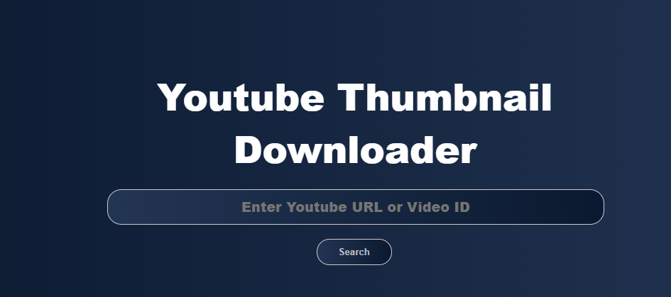
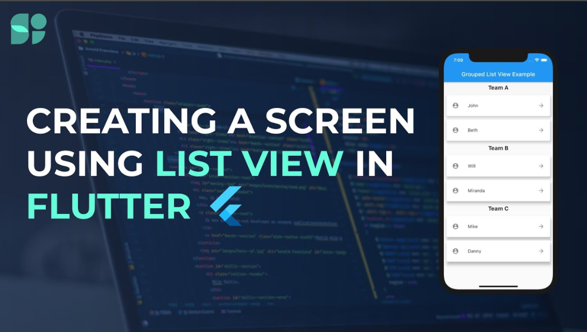

<h1 align="center"><a href="https://semikolan-co.github.io/YouTube-Thumbnail-Downloader">Youtube Thumbnail Downloader</a></h1>

  <p align="center">
    Youtube Thumbnail Downloader is a Simple Web page Tool, which is used to download the thumbnail of any youtube video.   
</p>


<!-- TABLE OF CONTENTS -->
## Table of Contents

* [Youtube Thumbnail Downloader](#about-the-project)
  * [Built With](#built-with)
* [Getting Started](#getting-started)
  * [Prerequisites](#prerequisites)
  * [Installation](#installation)
* [Contributing](#contributing)
*[Working](#working)
*[Join Us](#join-us)


<!-- ABOUT THE PROJECT -->
## About The Project

Free, Clean & Simple YouTube Thumbnail Downloader for you. 🙂 Download YouTube video thumbnails with ease. 

### Built With
This project is build with following languages and framework
* [HTML](https://html.com)
* [CSS](https://developer.mozilla.org/en-US/docs/Web/CSS)
* [JavaScript](https://www.javascript.com/)


<!-- GETTING STARTED -->
## Getting Started

This is an example of how you may give instructions on setting up your project locally.
To get a local copy up and running follow these simple example steps.

### Prerequisites
*  Text editor

### Installation
1. Fork the repo in your github account.

2. Clone the repo
```sh
git clone https://github.com/<your_username_>/YouTube-Thumbnail-Downloader.git
```
3. Move toward the Root directory .
```sh
   cd YouTube-Thumbnail-Downloader
```
4. Run the index.html
<!-- CONTRIBUTING -->
## Contributing

Contributions are what make the open source community such an amazing place to be learn, inspire, and create. Any contributions you make are **greatly appreciated**.

1. Fork the Project
2. Create your Feature Branch (`git checkout -b feature/AmazingFeature`)
3. Commit your Changes (`git commit -m 'Add some AmazingFeature'`)
4. Push to the Branch (`git push origin feature/AmazingFeature`)
5. Open a Pull Request.

In case of any doubts feel free to hop onto our [Discord Server](https://discord.semikolan.co) for help.

<!--Working-->
## Working 

1. [Click here]( https://semikolan-co.github.io/YouTube-Thumbnail-Downloader/)

    This is how it look like after moving on the page.
<p align="center">
  
</p>

2. Paste any youtube link of which thumbnails you want.

3. Click on search button.

4. After that download option came like this:
<p align="center">
  
</p>

5. Tap on download image will start downloading.

Example:
<p align="center">
  
</p>

## Join Us

Be a part of the SemiKolan Developer's Community by joining our [Discord Server](https://discord.semikolan.co). Here you can discuss about the project or ask any other queries and there will be a lot of folks to help

[](https://discord.semikolan.co)


## Code Contributers

This project exists thanks to all the people who contribute.

<a href="https://github.com/semikolan-co/keep-document/graphs/contributors">
  
</a>

